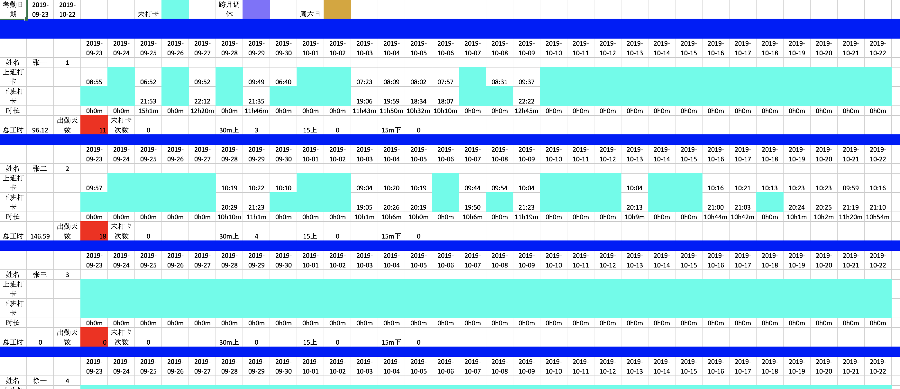

#### 重要：考勤导入的所有数据都必须是xlsx文件，xls文件不能解析，请先转成xlsx文件再进行下面操作。  

##### go mod tidy
1.修改da分区下，修改start 和end中的数据，更新为考勤日期  
2.修改folder分区下input为初始文件放置的位置，output为生成文件放置的位置  
3.先到tempconfig.ini 文件里查看userorder一栏，查看该月份在职的人员，如果有出入，请删除或者添加  
4.执行go run step0，会生成对应目录，并且几个原始的考勤表放入input文件夹下  
5.执行go run step1，会生成config.ini 文件  
6.请打开config.ini，请确保changhua、pudong、maoming、dingding分区内的等于号右侧为数字，如果不为数字，是名字的话，例如changhua分区内12=陈二，不符合条件，解决办法是：  
打开config.ini文件,将不为数字的改为数字，并且添加新的用户，然后不需要执行go run step1  
7.再三检查config.ini，changhua、pudong、maoming、dingding分区内的等于号右侧为数字，如果有名字，请重复5步骤，如检查完成之后，tempconfig.ini 文件不要再动，如果有需要修改直接操作config.ini文件  
8.运行go run step2，生成的excel是在output里，，exportexcelfile分区下firstexportexcelfile =号右侧更改成相对应的名字  
10.考勤报表截图如下图所示：  
  

